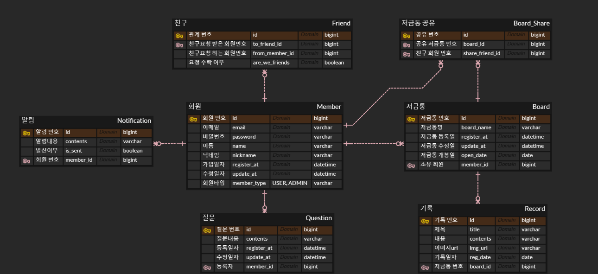

# 행복저금통 서비스
- 스프링부트 기반의 백엔드 프로젝트입니다.
- 저금통과 같이 하루마다 행복했던 순간과 장면을 기록하고 일정 기간 이후 그 기록들을 조회할 수 있는 서비스입니다.
- 추가적인 기능으로는 일주일에 한 번 질문을 던지고, 그에 답을 한다면 그 기록 또한 저금통에 저장하는 기능이 있습니다.
- 회원들 간의 친구추가 기능이 있어 친구들과 느꼈던 행복을 공유할 수 있습니다.

## 프로젝트 기능 및 설계
- 회원가입 기능
    - 사용자는 회원가입을 할 수 있다. 일반적으로 모든 사용자는 회원가입시 USER 권한 (일반 권한)을 지닌다. 관리자의 경우 ADMIN 권한을 지닌다.
    - 회원가입시 이메일과 이름, 닉네임, 패스워드를 입력받으며, 이메일과 닉네임은 unique 해야한다.
    - ~~카카오 로그인 API를 사용해 카카오톡 계정정보를 통한 회원가입을 진행할 수 있다.~~

- 로그인 기능
    - 사용자는 로그인을 할 수 있다. 로그인시 회원가입 때 사용한 아이디와 패스워드가 일치해야한다.

- 저금통 등록 기능
    - 저금통은 일종의 게시판 역할이다. 한 사용자 당 최대 3개까지 등록이 가능하다.
    - 로그인한 사용자는 권한에 관계 없이 글을 작성할 수 있다.
    - 사용자는 저금통 이름과 개봉일을 지정해야한다.
    - 저금통 개봉일은 한달 / 3개월 / 6개월 / 12개월 / 연말(새해되기 일주일 전) 을 기준으로 설정할 수 있다.

- 저금통 목록 조회 기능
    - 저금통 조회시 저금통의 이름과 개봉일자를 응답한다.

- 하루 기록 기능
    - 로그인한 사용자는 권한에 관계 없이 글을 작성할 수 있다.
    - 사용자는 하루에 한 번 사진을 포함해 글 내용(텍스트)을 작성할 수 있다.

- 랜덤 질문 기능
    - 관리자는 질문을 추가할 수 있다.
    - ~~일주일에 한 번(매주 일요일) 회원들은 랜덤으로 질문을 받게 된다. 질문에 답을 할 경우에만 저금통에 질문내용과 답이 저장된다.~~

- 기록 목록 조회 기능
    - 로그인한 사용자는 저금통 개봉일이 지나야 기록들을 조회할 수 있다.
    - 저금통 개봉일에는 알림이 발송된다.
    - 기록은 오래된 순으로 기본 정렬된다.
    - 기록 목록 조회시 응답에는 제목과 내용, 이미지URL, 기록일자의 정보가 필요하다.
    - 이미지는 AWS S3를 이용해 저장한 후 이미지URL을 DB에 저장한다.
    - 기록이 많을 수 있으므로 paging 처리를 한다.

- 특정 기록 조회 기능
    - 기록 목록 중 특정 기록 조회 시 기록 제목과 내용, 이미지URL, 기록일자가 조회된다.

- 친구 추가 기능
    - 닉네임으로 회원을 검색, 친구 요청을 보낼 수 있다.

- 친구 요청 목록 및 친구 목록 조회 기능
    - 친구 요청 목록은 요청 수락 여부가 false인 회원의 닉네임이 조회된다.
    - 친구 요청은 수락 또는 거절할 수 있다. 거절할 경우 friend 테이블에서 요청이 삭제된다.
    - 친구 목록의 경우 회원과 상대 회원 모두 요청 수락 여부가 true인 회원의 닉네임이 조회된다.
    - 목록이 많을 수 있으므로 paging 처리를 한다.

- 저금통 친구 공유 기능
    - 회원은 친구를 맺은 회원에게 저금통을 공유할 수 있다.

- 친구 저금통 목록 조회 기능
    - 공유 받은 저금통의 목록을 조회할 수 있고, 목록이 많을 수 있으므로 paging 처리를 한다.
    - 저금통 목록을 조회할 경우 저금통 이름, 소유자 닉네임이 조회된다.
    - 저금통의 내용 또한 위의 기록 목록 조회 기능, 특정 기록 조회 기능과 같이 조회가 가능하다.

## ERD

## Trouble Shooting
[go to the trouble shooting section](doc/TROUBLE_SHOOTING.md)

### Tech Stack

 
   
   
   
  
  

